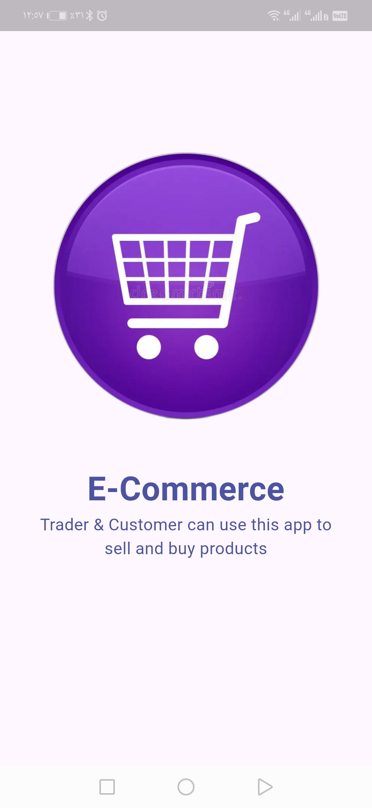
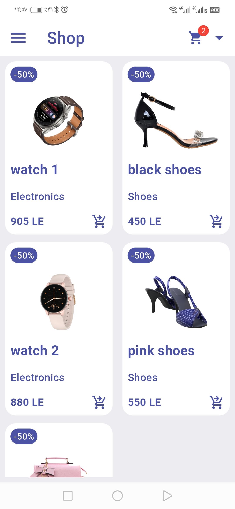
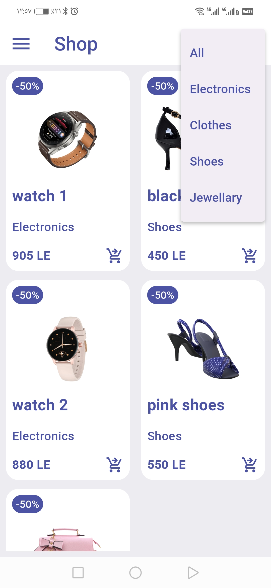
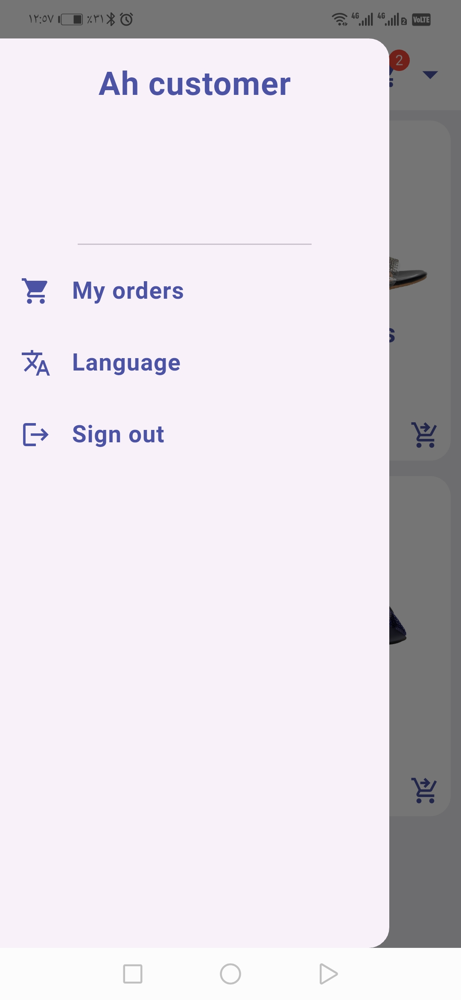
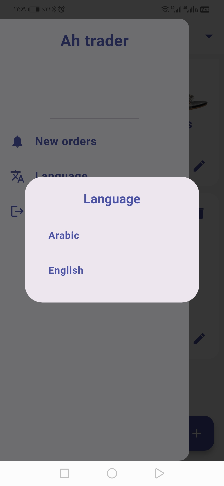
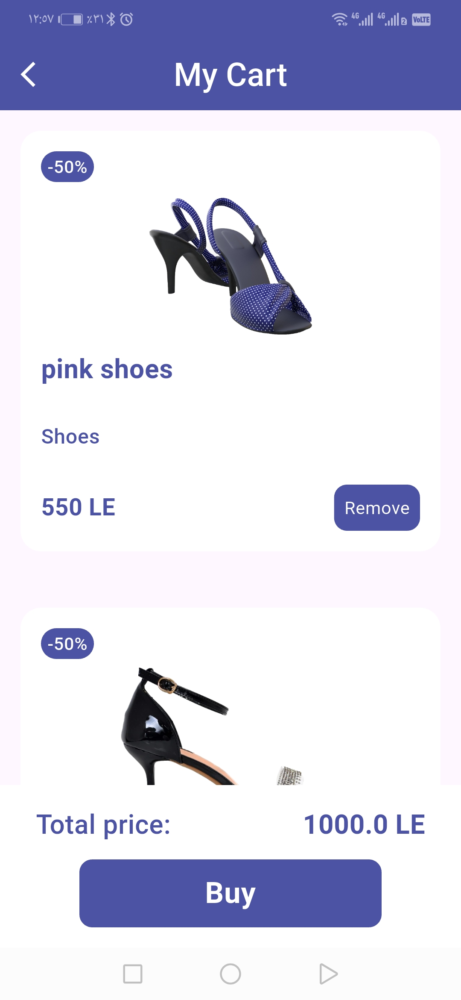
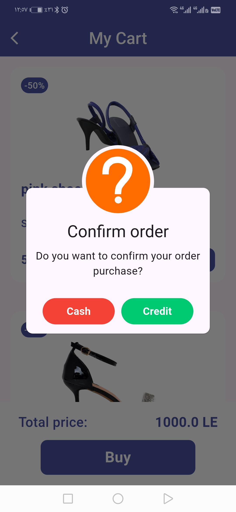
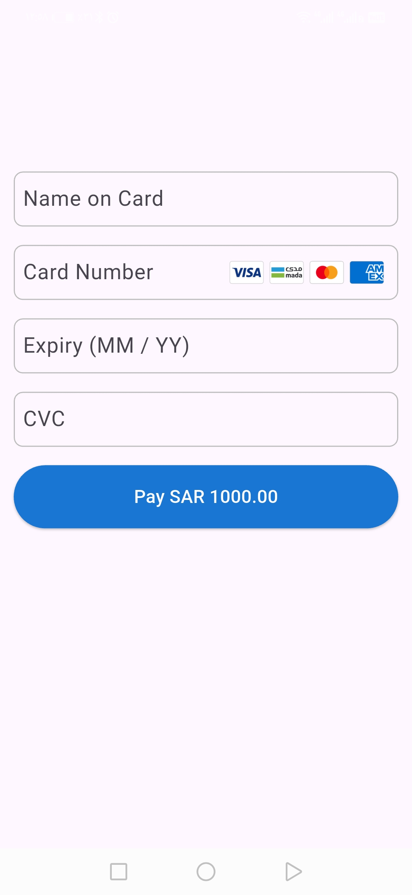
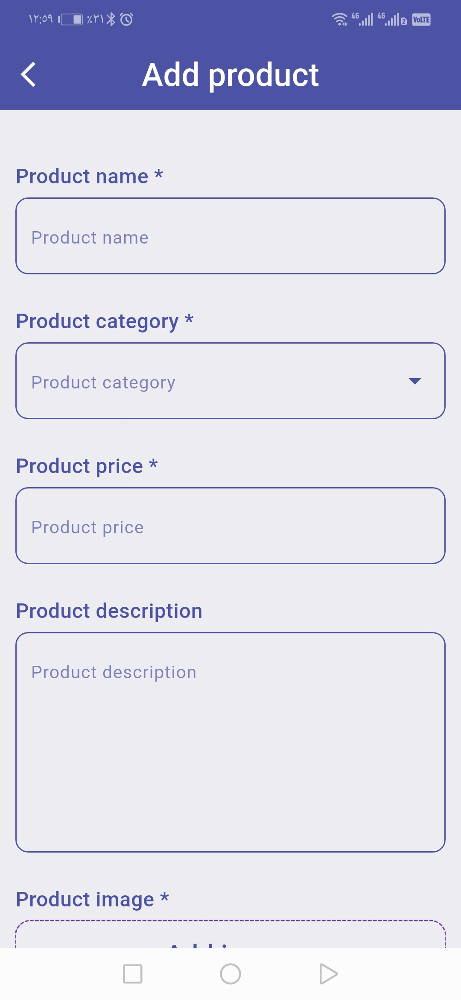
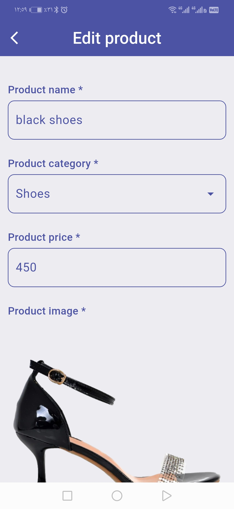

# 🛒 E-Commerce Flutter App    (68 work hour)


A complete mobile **e-commerce application** built with Flutter, supporting **Trader** and **Customer** roles. The platform enables seamless product management, secure payments, order handling, and real-time communication between sellers and buyers.

> 🌍 **Multilingual Support**: Available in **English** and **Arabic**

---

 
## [⬇️ Download APK](https://github.com/AhmedNasser24/e_commerce_app/releases/download/v1.0.0/app-release.apk)


## 👥 User Roles

### 🧑‍💼 Trader Features:
- ➕ Create, ✏️ edit, and ❌ delete products
- 📦 View and manage incoming customer orders
- 💬 Contact customers via **WhatsApp** to complete purchases
- 🔔 Auto-send **push notifications** to all customers when a new product is added

### 🛍️ Customer Features:
- 🛒 Browse and shop from a wide range of products
- 🧺 Add products to the shopping cart
- 💳 Complete purchases using **credit card** or **cash on delivery**

---

## 🔧 Tech Stack & Tools

- **State Management:** `Cubit` & `setState`
- **Authentication & Backend:** Firebase Auth & Firestore
- **Notifications:** Firebase Cloud Messaging (FCM)
- **Payments:** [Moyasar](https://moyasar.com/) Payment Integration
- **Local Storage:** `shared_preferences` package
- **Architecture:** Clean Code practices
- **UI:** Fully Responsive Design

---

## 📸 Screenshots

<div align="center">




<br><br>




<br><br>




<br><br>




<br><br>




<br><br>




</div>

---

## 📦 Installation

To run this app locally:

```bash
# Clone the repository
git clone https://github.com/AhmedNasser24/e_commerce_app.git

# Navigate into the project directory
cd e_commerce_app

# Install dependencies
flutter pub get

# Run the app
flutter run


